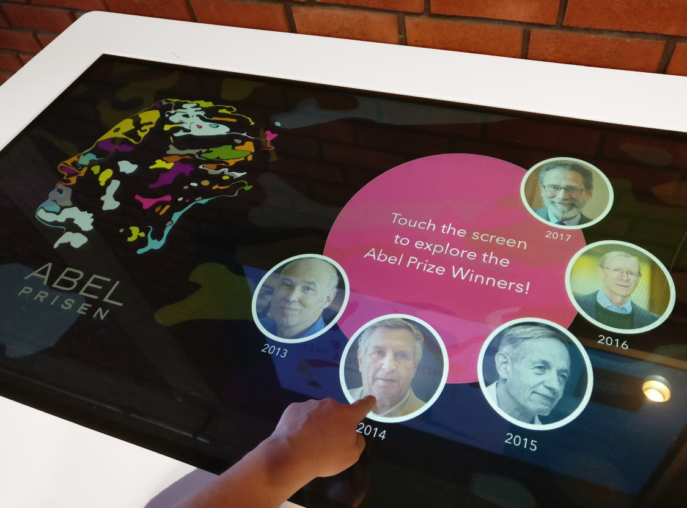

# Ximpel kiosk tools and tricks

This repo contains [idletracker.js](./idletracker.js) and some tricks for using [Ximpel](http://ximpel.net/) as a kiosk platform.
These are outcomes from the [Visual Navigation Project](https://www.ub.uio.no/om/prosjekter/the-visualisation-project/) at the University of Oslo Library.



## Idletracker

Idletracker is a simple add-on for Ximpel that automatically resets the app after some time of inactivity
(no touch events or mouse moves).

```javascript
// Create a Ximpel instance
var app = new ximpel.XimpelApp('ximpelapp', 'playlist.xml', 'config.xml');

// Tell Ximpel to load the playlist and config, but do not play automatically,
// since we want to configure IdleTracker before Ximpel starts playing.
app.load({autoPlay: false}).done(function() {

    // When Ximpel is ready, initiate Idletracker
    IdleTracker.configure({
        limit: 30,          // Time of inactivity in seconds before the app is reset.
        debug: true,        // Show countdown in the browser console, useful for testing purposes.
        app: app,           // Tell IdleTracker about our Ximpel app
    });

    // Then start playing the app
    app.ximpelPlayer.play();
});
```

See [demo1](./demos/demo1.html) for a working example.

### Idletracker – rules for special cases

Rules can be defined to support special cases. For instance, you might have long-running videos
where you don't want to reset the app in the middle of the video even though the user is idle.

```javascript
// Create a Ximpel instance
var app = new ximpel.XimpelApp('ximpelapp', 'playlist.xml', 'config.xml');

// Tell Ximpel to load the playlist and config, but do not play automatically,
// since we want to configure IdleTracker before Ximpel starts playing.
app.load({autoPlay: false}).done( function () {

    // When Ximpel is ready, initiate Idletracker
    IdleTracker.configure({
        limit: 30,          // Time of inactivity in seconds before the app is reset.
        app: app,           // Tell IdleTracker about our Ximpel app
        rules: [
            {
                // Pause the timer during any scene that starts with "video:"
                pattern: /^video:/,
                pause: true,
            }
        ],
    });

    // Then start playing the app
    app.ximpelPlayer.play();
});
```

See [demo2](./demos/demo2.html) for a working example.

### Idletracker – iframes and YouTube videos

When an [iframe](http://www.ximpel.net/docs/html5/playlist_iframe.htm) is opened, Idletracker will try to attach to it to register any activity there as well.

* This only works with recent versions of Ximpel. If you see an error message in your [browser console](https://developers.google.com/web/tools/chrome-devtools/console/) about "iframe_open" not being supported, please upgrade Ximpel to the latest version.

* Standard browser security will prevent Idletracker from attaching to iframes from *other domains* than the current one.
A warning will be shown in the browser console if Idletracker cannot attach to an iframe.
If you decide that you actually want to serve content from another domain directly in your Ximpel app and you want Idletracker to still work, you will have to [disable the browser's same-origin policy](https://www.thegeekstuff.com/2016/09/disable-same-origin-policy/).
For Chrome, this means setting the `--disable-web-security` and `--user-data-dir` flags.

* While [the YouTube mediatype](http://www.ximpel.net/docs/html5/playlist_youtube.htm) technically uses iframes from a a different domain, the component adds an overlay so that any events are registered as normal without having to disable the browser's same-origin policy.

## Keeping users within the app

### Disabling external links in iframes

When displaying iframe content, you might not want the user to navigate away from the displayed site.
The code below can be used to prevent that from happening.
Replace `!evt.target.host.match(/uio.no/)` with a test for your domain of choice.

```javascript
// Create a Ximpel instance
var app = new ximpel.XimpelApp('ximpelapp', 'playlist.xml', 'config.xml');

// Tell Ximpel to load the playlist and config, but do not play automatically,
// since we want to configure event subscribers before Ximpel starts playing.
app.load({autoPlay: false}).done( function () {

    // When an iframe is created,
    app.ximpelPlayer.addEventHandler('iframe_open', function() {

        // listen to click events in the iframe.
        $('iframe')[0].contentWindow.addEventListener('click', function(evt) {

                // If a link is clicked and the link target does not contain uio.no,
                if (evt.target && evt.target.host && !evt.target.host.match(/uio.no/)) {
                    console.warn('Aborting navigation to ' + evt.target.host);
                    event.preventDefault();
                }
        }, true);
    });

    // Then start playing the app
    app.ximpelPlayer.play();

});
```

Note that attaching to iframes this way only works for iframes at the *same domain* as the Ximpel app.

- If you need to disable external links in an iframe hosted at another domain, you could either
set up a proxy at your own domain, or disable the browser's same-origin police (more information about that
under "Idletracker – iframes and YouTube videos" above).

- In some specific cases, it can also work to just add some strategically placed overlays over the external links
  to catch the clicks. For an example, see the "iframe example" in [the demo playlist](./demos/playlist.xml)
  and the resulting effect [here](./demos/demo3.html#iframe:earth).

### YouTube videos

Ximpel adds an overlay to prevent users from navigating away from an embedded video.
However, we identified a strange issue where a small part of the YouTube logo still was clickable in some cases.
Our workaround was to apply the CSS below:

```css
/* Very weird fix to make the youtube-logo non-clickable in touch mode on chrome.. */
.youtubeClickCatcher {
    width: 110% !important;
    height: 110% !important;
}
```

## Resizing to window size / Starting in fullscreen

Ximpel ships with a fullscreen button that uses the [fullscreen API](https://developer.mozilla.org/en-US/docs/Web/API/Fullscreen_API) of the browser, but this cannot be triggered automatically, so when running Ximpel as a kiosk system, we
start the browser in fullscreen using the appropriate command line flag (e.g. `chrome --kiosk`) and then let Ximpel
fill the size of the window. First, a small piece of CSS is needed:

```css
body {
    background: black;
    height: 100%;
    margin: 0;
}
```

Next, we need to specify `appWidth` and `appHeight` and update the values whenever the window resizes:

```javascript
// Create a Ximpel instance
var app = new ximpel.XimpelApp('ximpelapp', 'playlist.xml', 'config.xml', {
    appWidth: window.innerWidth + 'px',
    appHeight: window.innerHeight + 'px',
});

// Tell Ximpel to load the playlist and config file.
app.load({autoPlay: false}).done(function() {
    // Then start playing.
    app.ximpelPlayer.play();
});

// Update the dimensions of the ximpel element on window resize
$(window).on('resize', function onResize() {
    $('.ximpelApp').width(window.innerWidth);
    $('.ximpelApp').height(window.innerHeight);
});
```

Note: In general it's good practice to throttle the `resize` event since it can fire very rapidly.
However, Ximpel already does this internally, so we don't need to do it here.

See [demo3](./demos/demo3.html) for a working example that also includes IdleTracker.

## License and image credits

- `idletracker.js` is free software released into the public domain (can be used freely without any restrictions).
- The repo also contains a copy of Ximpel under `demos/ximpel`, which is licensed under ???.
- Image credits:

  - [abel.jpg](http://www.ximpel.net/abel-prize-touch-app/): Hugo Huurdeman (2017)
  - [demos/media/2017-12-13-08-35-12.jpg](https://pixnio.com/flora-plants/crops/vineyard-agriculture-landscape-nature-hill-countryside): public domain (CC0)
  - [demos/media/2017-12-14-19-50-08.jpg](https://pixnio.com/flora-plants/crops/field-oil-rapeseed-agriculture-landscape-oilseed-sky): public domain (CC0)
